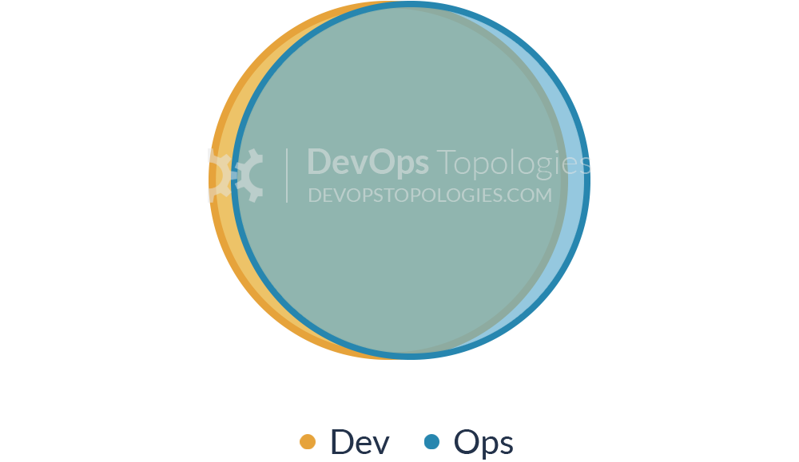
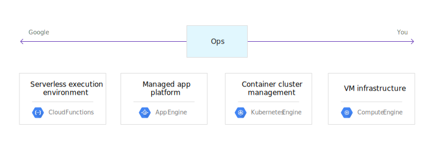
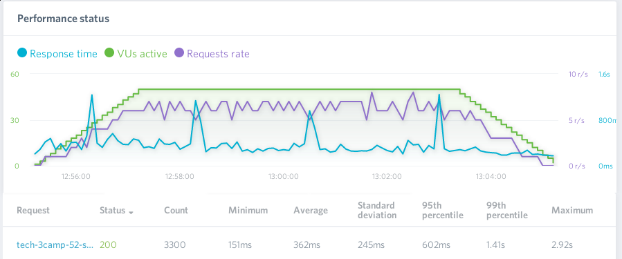
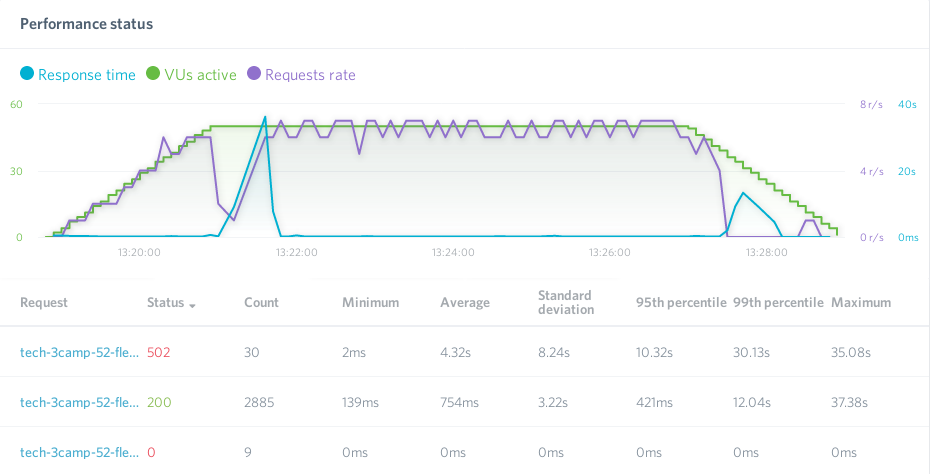
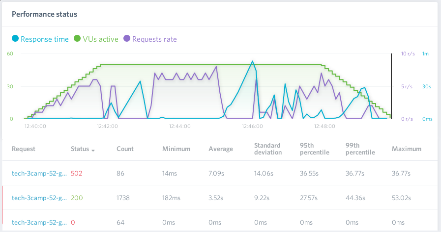

<!-- .slide: class="center pic-bg" data-background="./images/bg-title.jpg" -->

<style>

.reveal {
  font-size: 36px;
}

.reveal .controls, .reveal .progress , .reveal a, .reveal a:hover {
  color: #98cf2b;
}

.reveal pre {
  font-size: .4em !important;
}

.reveal h1 {
  background: linear-gradient(to right, #98cf2b, #a2dd2c) !important;
  color: #fff;
  padding: 2rem;
  margin: 1% -5%;
  box-shadow: 0 4px 8px 0 rgba(0, 0, 0, 0.2), 0 6px 20px 0 rgba(0, 0, 0, 0.19);
}

.reveal h2 {
  background: linear-gradient(to right, #98cf2b, #a2dd2c) !important;
  color: #fff;
  padding: 20px;
  margin: .5em -5%;
  box-shadow: 0 4px 8px 0 rgba(0, 0, 0, 0.2), 0 6px 20px 0 rgba(0, 0, 0, 0.19);
}

.reveal blockquote {
  width: 100%;
  font-size: .8em;
}

.reveal .stretch > code {
  /*max-height: none !important;*/
  /*height: auto !important;*/
}

.reveal section img {
  background: none !important;
  border: none !important;
  box-shadow: none !important;
}

.reveal .slides {
  text-align: left !important;
}

.reveal .slides .center {
  text-align: center !important;
  margin: auto !important;
}

.reveal ul > li {
  margin: 0 .5em;
}

.reveal ol > li {
  margin: .5em .5em;
}

.reveal code:not(.hljs) {
  font-size: 0.8em;
}

.pic-bg p {
  background: rgba(255,255,255,0.75);
  border-radius: 10px;
  padding: 10px 40px;
  width: fit-content;
  margin: auto;
  margin-top: 1em;
}
</style>

## Od Google App Engine do Kubernetesa – łatwa droga do skomplikowanego rozwiązania

**Wojciech Urbański**

----

<!-- .slide: data-background="./images/bg-grandpa.jpg" -->


---

<!-- .slide: data-background="./images/bg-about.jpg" -->
## Wojciech Urbański

**Początki:** Administrator SKOS PG. Całe *życie zawodowe* w CI.

**Zainteresowania IT:** Automatyzacja, statystyki, monitoring.

Gdy brakuje mi narzędzi, to je sobie piszę. (Głównie w pythonie)

GCP Certified Architect & Trainer

**Czas wolny:** gram, robię zdjęcia telefonem. (:

[github](https://github.com/wurbanski/) - [blog](https://blog.wurbanski.me) - [e-mail](mailto:hello@wurbanski.me)

Note: Aktualnie współpracuję z Codilime
---

<!-- .slide: class="center pic-bg" data-background="./images/bg-cloud.jpg" -->

## 3 słowa: Google Cloud Platform


----

<center></center>

----

## FaaS → PaaS → CaaS → Iaas



---

<!-- .slide: class="center pic-bg" data-background="./images/bg-standard.jpg" -->

# App Engine Standard

----

## App Engine Standard

Platforma jako usługa (PaaS)

Kod uruchomiony w piaskownicy na instancjach zarządzanych przez Google

Automatyczne skalowanie (od 0 do N) każdego serwisu w zależności od natężenia ruchu

Wspierane języki: Go (1.9, 1.11), Java (7, 8), Node.js (8, 10), PHP (5.5, 7.2), Python (2.7, 3.7)

Wbudowany HTTPS

----

## Integracja z GCP

Integracja z innymi usługami GCP (Cloud Storage, Datastore, ML APIs...)

**Brak** dostępu do Compute Engine (VM)

Potrzebne ustawienia (np. konta serwisowe) są wstrzykiwane przez platformę

Automatyczny monitoring aplikacji (np. śledzenie błędów)

----

## Ograniczenia

Limity zasobów instancji:
  * od 128 MB/600 MHz (domyślnie)
  * do 1024 MB/4.8 GHz (max, ręczne skalowanie)

Opłaty za zużycie zasobów

Darmowe użycie: 1 GB przechowywanych danych i transferu (+&nbsp;limity innych usług)

----

## Zaawansowane użycie

zadania cykliczne (cron)

wiele serwisów (microservices)

wiele wersji jednocześnie (podział ruchu, testy A/B)

memcache

----

## Przykładowa aplikacja

Wykorzystanie Google Datastore

Aplikacja w Pythonie 3.7, uzywając Flaska

Plik konfiguracyjny:

```
runtime: python37
```

[tech-3camp-52-std.appspot.com](https://tech-3camp-52-std.appspot.com)

----

## Przykładowa aplikacja

<center><a href="https://asciinema.org/a/XscU3pkuIM28YQkMXKbB1CXd8" target="_blank"></a></center>

---

<!-- .slide: class="center pic-bg" data-background="./images/bg-flexible.jpg" -->

# App Engine Flexible

----

## Platforma

Dostepne wsparcie dla: Go (1.9, 1.10, 1.11), Java 8, Node.js, PHP (5.6, 7.0, 7.1, 7.2), .Net, Python (2.7, 3.7)

Wsparcie dla własnych obrazów

Kontenery uruchamiane na instancjach Google Compute Engine (VM)
* dostęp SSH!
* maszyny cyklicznie restartowane i aktualizowane (raz na tydzień)
* pełna kontrola nad środowiskiem aplikacji (Dockerfile)

----

## App Engine Flexible a Docker

`gcloud beta app gen-config --custom`

```
FROM gcr.io/google-appengine/python
LABEL python_version=python3.6
RUN virtualenv --no-download /env -p python3.6

# Set virtualenv environment variables. This is equivalent to running
# source /env/bin/activate
ENV VIRTUAL_ENV /env
ENV PATH /env/bin:$PATH
ADD requirements.txt /app/
RUN pip install -r requirements.txt
ADD . /app/
CMD exec gunicorn -b :$PORT main:app
```

lub własny Dockerfile w katalogu z aplikacją

Dockerfile używane przez GAE Flex są dostępne na githubie

----

## Wdrożenie aplikacji

`gcloud app deploy` i...
1. (Dla wbudowanych platform) Wygenerowanie Dockerfile'a
2. Budowa obrazu kontenera i upload do Google Container Registry
3. Uruchomienie nowej wersji kontenera na wyznaczonych maszynach

Wszystko przy użyciu Google Cloud Build

----

## Przykładowa aplikacja

Ta sama aplikacja, co w przypadku GAE Standard

```bash
# app.yaml
runtime: python
env: flex
entrypoint: gunicorn -b :$PORT main:app

runtime_config:
  python_version: 3

# Przykładowa konfiguracja skalowania
# automatic_scaling:
# min_num_instances: 1
# max_num_instances: 15
# cool_down_period_sec: 180
# cpu_utilization:
#   target_utilization: 0.6

```


[tech-3camp-52-flex.appspot.com](https://tech-3camp-52-flex.appspot.com)

----

## Przykładowa aplikacja

<center><a href="https://asciinema.org/a/FMnEPKo2zlhi3q8Ou04ifU1PG" target="_blank"></a></center>

---

<!-- .slide: class="center pic-bg" data-background="./images/bg-choice.jpg" -->

# Standardowo czy elastycznie?

----

##  Standardowo czy elastycznie?

|                | Standard                | Flex                                    |
|---------------:|-------------------------|-----------------------------------------|
| Infrastruktura | instancja w piaskownicy | Docker na maszynie wirtualnej (GCE)     |
| Ruch           | nagły, zmienny          | stały lub zmienny stopniowo             |
| Platforma      | ograniczona liczba      | dowolne, pełna kontrola nad Dockerfilem |

---

<!-- .slide: class="center pic-bg" data-background="./images/bg-matrix.jpg" -->

## Enter ~~the Matrix~~ Kubernetes

----

## Kubernetes

alias [k8s](https://k8s.io)

System do automatyzacji wdrożeń, skalowania, zarządzania aplikacjami w kontenerach

Wiele dostarczanych środowisk (AWS, GCP, Azure, DigitalOcean) lub na własnej infrastrukturze (np. Kubernetes, OpenShift)

Samoleczący się, skalowalny horyzontalnie, zarządza sekretami i konfiguracją usług...

----

## Google Kubernetes Engine

Zarządzany przez Google, wysokodostępny klaster k8s

Kontrola nad liczbą i zasobami węzłów, wdrożeniami, aktualizacjami...

Dostęp przez `kubectl` i konsolę GCP

Węzły wykorzystują Container-Optimized OS (COS)

Master zarządzany przez Google

----

## Podstawowe zadania operatora

1. Buduj obrazy kontenerów
2. Przygotuj opis wdrożenia komponentu systemu* na klaster
3. Zaaplikuj plik YAML na klastrze
4. Wróć do punktu 1...

(*) to może być deployment, serwis, load balancer, ingress...

---

<!-- .slide: class="center pic-bg" data-background="./images/bg-question.jpg" -->

# Jak to połączyć z App Engine?

----

## Kontener z Flex na k8s...

1. App Engine Flex tworzy obrazy Dockerowe, które mogą być wykorzystane w Kubernetesie

2. Brak integracji GKE z usługami GCP jak np. Datastore, wymagane:
  * odpowiednie konta serwisowe
  * uprawnienia użytkowników do projektów i zasobów

----

## ...w kilku prostych krokach...

```bash
# Lista obrazów w projekcie
gcloud container images list \
--repository=eu.gcr.io/${PROJECT}/appengine \
--project=$PROJECT

# Konfiguracja kubectl
gcloud container clusters get-credentials $CLUSTER \
--zone=$ZONE \
--project=$PROJECT

kubectl get nodes

# Tworzymy konto serwisowe
gcloud iam service-accounts create $SACCOUNT \
--display-name=$SACCOUNT \
--project=$PROJECT

# Generujemy klucz, którego użyjemy w secretach
gcloud iam service-accounts keys create ./key.json \
--iam-account=${SACCOUNT}@${PROJECT}.iam.gserviceaccount.com \
--project=$PROJECT

# Dodajemy uprawnienia dla usera do dostępu do Datastore
gcloud projects add-iam-policy-binding $PROJECT \
--member=serviceAccount:${SACCOUNT}@${PROJECT}.iam.gserviceaccount.com \
--role=roles/datastore.user

# Dodajemy klucz jako secret
kubectl create secret generic datastore-key \
--from-file=key.json=./key.json
```

----

## ...już za chwileczkę

```yaml
apiVersion: apps/v1beta1
kind: Deployment
metadata:
  name: datastore
spec:
  replicas: 1
  template:
    metadata:
      labels:
        app: datastore
    spec:
      volumeMountsmes:
      - name: google-cloud-key
        secret:
          secretName: datastore-key
      containers:
      - name: datastore
        image: eu.gcr.io/tech-3camp-52-flex/appengine/default.20190212t003442:latest
        ports:
        - name: http
          containerPort: 8080
          protocol: TCP
        volumeMounts:
        - name: google-cloud-key
          mountPath: /var/secrets/google
        env:
        - name: GOOGLE_APPLICATION_CREDENTIALS
          value: /var/secrets/google/key.json
        - name: GCLOUD_DATASET_ID
          value: tech-3camp-52-flex
```

[tech-3camp-52-gke](https://tech-3camp-52-gke.wurbanski.me)

---

<!-- .slide: class="center pic-bg" data-background="./images/bg-fight.jpg" -->

# k8s vs GAE - Fight!

----

## Klaster k8s vs GAE

Instancje Standard:
* 600 MHz, 128MB RAM

Instancje Flex:
* 1 vCPU, 1 GB RAM

Klaster k8s:
* autoskalowanie węzłów (1 vCPU, 1GB RAM)
* autoskalowanie podów (przy 30% CPU)

----

## Pomiary - Standard

<center></center>

----

## Pomiary - Flex

<center></center>

----

## Pomiary - k8s

<center></center>

---

## Co zrobić? Jak żyć?

Aplkacja stworzona do uruchomienia w App Engine może stosunkowo łatwo zostać przeniesiona do Kubernetesa

PaaS (np. App Engine) dają dużo możliwości dla mało- i średnio wymagających aplikacji o nieskomplikowanej architekturze i warto je poznać

Kubernetesa trzeba dobrze poznać, ale daje bardzo duże możliwości kontroli aplikacji

---

<!-- .slide: class="center pic-bg" data-background="./images/bg-theend.jpg" -->
# Dziękuję

[hello@wurbanski.me](mailto:hello@wurbanski.me) - [slides.wurbanski.me](https://slides.wurbanski.me/windows-ci)

[](mailto:wojciech.urbanski@codilime.com)

