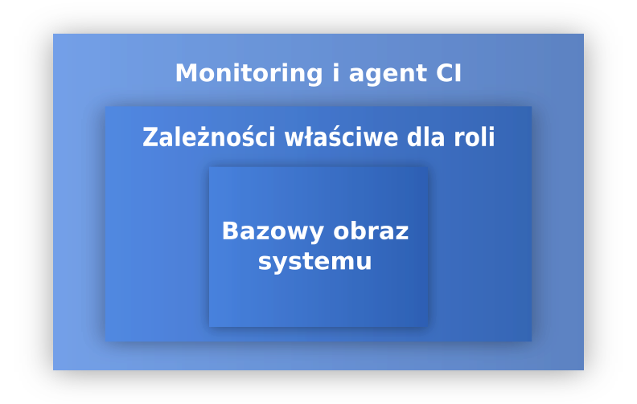
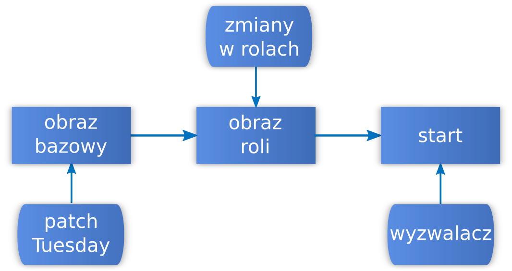

<!-- .slide: class="center pic-bg" data-background="./images/bg-mountainroad.jpg" -->

<style>

.reveal {
  font-size: 36px;
}

.reveal pre {
  font-size: .4em !important;
}

.reveal h1 {
  background: linear-gradient(to right, #4882e1, #285baf) !important;
  color: #fff;
  padding: 2rem;
  margin: 1% -5%;
  box-shadow: 0 4px 8px 0 rgba(0, 0, 0, 0.2), 0 6px 20px 0 rgba(0, 0, 0, 0.19);
}

.reveal h2 {
  background: linear-gradient(to right, #4882e1, #285baf) !important;
  color: #fff;
  padding: 20px;
  margin: .5em -5%;
  box-shadow: 0 4px 8px 0 rgba(0, 0, 0, 0.2), 0 6px 20px 0 rgba(0, 0, 0, 0.19);
}

.reveal blockquote {
  width: 100%;
  font-size: .8em;
}

.reveal .stretch > code {
  /*max-height: none !important;*/
  /*height: auto !important;*/
}

.reveal section img {
  background: none !important;
  border: none !important;
  box-shadow: none !important;
}

.reveal .slides {
  text-align: left !important;
}

.reveal .slides .center {
  text-align: center !important;
  margin: auto !important;
}

.reveal ul > li {
  margin: 0 .5em;
}

.reveal ol > li {
  margin: .5em .5em;
}

.reveal code:not(.hljs) {
  font-size: 0.8em;
}

.pic-bg p {
  background: rgba(255,255,255,0.75);
  border-radius: 10px;
  padding: 10px 40px;
  width: fit-content;
  margin: auto;
  margin-top: 1em;
}
</style>

## Czy Windows w systemie Continuous Integration może być obywatelem pierwszej kategorii?

**Wojciech Urbański**

Note: Według *prawa nagłówków Betteridge'a* na każdy nagłówek będący pytaniem można odpowiedzieć przecząco. Odpowiedź na dzisiejsze pytanie pozwolę sobie oczywiście zostawić na koniec.

----

## Notka wstępna

Prezentacja **będzie**:

- bazowała na prawdziwej historii
- o Windowsie w systemie CI
- ale nie tylko!

Prezentacja **nie będzie**:

- przepisem
- lekiem na całe zło
- *obiektywnie idealnym* rozwiązaniem.

Note: Zanim zaczniemy, wyjaśnijmy kilka spraw. (...) Chętnie przedyskutuję alternatywy w częsci z pytaniami lub networkingu.

---

<!-- .slide: data-background="./images/bg-about.jpg" -->
## Wojciech Urbański

**Początki:** Administrator SKOS PG. Całe *życie zawodowe* w CI.

**Zainteresowania IT:** Automatyzacja, statystyki, monitoring.

Gdy brakuje mi narzędzi, to je sobie piszę. (Głównie w pythonie)

**W wolnym czasie:** gram, trochę podróżuję, robię zdjęcia telefonem. (:

[github](https://github.com/wurbanski/) - [twitter](https://twitter.com/wurbansk) - [blog](https://blog.wurbanski.me) - [e-mail](mailto:hello@wurbanski.me)

Note: Aktualnie współpracuję z Codilime

---

<!-- .slide: class="center" -->

# Zadanie

Zajmij się systemem CI <!-- .element: class="fragment" -->

dla projektu Windowsowego... <!-- .element: class="fragment" -->

związanego z SDN... <!-- .element: class="fragment" -->

będącego portem z Linuksa. <!-- .element: class="fragment" -->

Note: Postawmy się w sytuacji: trafiacie do nowego projektu. Dostajecie zadanie...
(...)
typowe dla DevOpsa

----

<!-- .slide: class="center" -->
# Wymagania

1. Ścisła definicja konfiguracji potrzebnych maszyn
2. Odporność na złośliwe akcje z zewnątrz
4. Jak największa bezobsługowość
5. Wspólne rozwiązania dla różnych platform - duży plus

Note: Na szczęście, mamy dosyć jasno sformułowane wymagania. 
Częściowo wynikają one z lekcji wyciągniętych przy poprzednich próbach zrobienia CI
(...) Brzmi łatwo, nie?

----

<!-- .slide: class="center pic-bg" data-background="./images/bg-watdo.jpg" -->

please advise <!-- .element: class="fragment" -->

wat do <!-- .element: class="fragment" -->

Note: Stajemy tu trochę przed problemem. Znamy wiele technik, które można wykorzystać, więc może spróbujmy to zrobić tak, jak z Linuksem? Jak się za to zabrać?

---

<!-- .slide: class="center pic-bg" data-background="./images/bg-mountain.jpg" -->
# Zrób to tak, żeby było dobrze

...i najlepiej na wczoraj ;-) <!-- .element: class="fragment" -->

Note: Oczywiście.

----

## No Ops, please

System ma być dostępny dla programistów.

Najlepiej bez konieczności ciągłej kontroli i interwencji zespołu *DevOps*. 

<!-- .element: class="fragment" -->

<div class="fragment">
<blockquote>
<p>Dawno temu ja też zaufałem pewnemu developerowi, wtedy dałbym sobie za niego rękę uciąć.</p>
<p>I wiesz, co... I bym teraz, windows, nie miał ręki.</p>
</blockquote>

<em>~Paulo DevOpselho</em>
</div>

Note: System dostępny dla programistów. To już brzmi dosyć przerażająco. Niestety, tak jak prawdopodobnie my nie jesteśmy najlepszymi na świecie programistami, tak progamiści często są PEBKAC.

A zostawić ich tam bez nadzoru? Wow, to odważne.

Oczywiście, na pewno każdy zna takich programistów, którym oddałby (ale na chwilę) pod kontrolę swoją konsole bez obaw. 

Nadal jednak ważna jest zasada ograniczonego zaufania. Jak na drodze.

----

## Projektowanie defensywne

>**Programowanie defensywne** - tworzenie oprogramowania z myślą o jego poprawnym działaniu nawet przy nieprzewidywalnych sposobach jego użycia.
>
>Techniki programowania defensywnego:
>- **Upraszczanie kodu źródłowego**
>- **Zewnętrzne audyty kodu źródłowego**
>- **Testowanie oprogramowania**
>- **Zasada najmniejszego uprzywilejowania**

*Źródło: [wiki](https://pl.wikipedia.org/wiki/Programowanie_defensywne)*

Note: Skorzystajmy więc z arsenału progamistów, aby chronić przed nimi nasz system. (...)

Podstawowe techniki programowania defensywnego:

Oczywiście, nie chcę tu szkalować programistów :)

----

## Czego nam potrzeba?

1. Skutecznego i prostego zarządzania konfiguracją systemów. <!-- .element: class="fragment" -->
2. Niezmienności infrastruktury. <!-- .element: class="fragment" -->
3. Automatyzacji wprowadzania i testowania zmian (CI/CD dla infrastruktury). <!-- .element: class="fragment" -->
4. Możliwości nadzoru nad kodem, który wpływa na infrastrukturę. <!-- .element: class="fragment" -->

Note: Po takiej krótkiej analizie, bazując na doświadczeniach swoich i innych, można zebrać kilka istotnych dla nas kwestii przy projektowaniu systemu.
  
(...)

Przybliżę za chwilę po kolei pomysły na kolejne zagadnienia.

---

<!-- .slide: class="center pic-bg" data-background="./images/bg-server.jpg" -->
# Zarządzanie konfiguracją

Note:

----

## Dostępne narzędzia

1. [Powershell Desired State Configuration](https://docs.microsoft.com/en-us/powershell/dsc/overview)
2. Polityki Active Directory
3. Chef, Puppet, Saltstack
4. Ansible
5. I inne (?)

Note: Zacznijmy od tematu najbardziej palącego, ale jednocześnie chyba najbardziej znanego...

Przeanalizowałem kilka z dostępnych narzędzi...
nie ukrywam, że wybrałem Ansibla.

Na poprzednim SO/Do Meetupie Maciek mówił, że zarządzanie konfiguracją umiera i kontenery są przyszłością... warto doprecyzować, że to prawda tylko w niektórych zastosowaniach, a pewnych zadań nie jesteśmy w stanie przenieść w prosty sposób do kontenerów...

(...)

----

## Powershell DSC

Podejście Microsoftu do Configuration Managementu.

Obsługuje tryby *push* i *pull*.

Długa lista zarządzalnych zasobów (wszystkie elementy systemu Windows).

`<subiektywnie>` Skomplikowany system przygotowywania konfiguracji serwerów. `</subiektywnie>`

Note: Microsoftowe podejście do tematu IaC. Jest architektura Push/Pull

Kiedy pojawiły sie o tym informacje, wydawało się, że MSFT trafił w 10, jednak moim zdaniem nie jest to zbyt dobrze przemyślany system.

Kolejne narzędzie do nauki, pozostałe zaczęły robić to dobrze.

----

## Powershell DSC

```powershell
Configuration WebsiteTest {
    Import-DscResource -ModuleName PsDesiredStateConfiguration

    Node 'localhost' {
    
        WindowsFeature WebServer {
            Ensure = "Present"
            Name   = "Web-Server"
        }
        
        File WebsiteContent {
            Ensure = 'Present'
            SourcePath = 'c:\test\index.htm'
            DestinationPath = 'c:\inetpub\wwwroot'
        }
    }
}
```

Note: Fragment kodu odpowiadający za konfigurację IIS i przykładowej strony WWW. Składnia niby podobna do innych systemów.

----

## Polityki Active Directory

Plusy:

+ wszystko dzieje się w tle
+ natywny dla Windowsa sposób zarządzania
+ DHCP, DNS, LDAP
+ "wystrzel i zapomnij"

Note: Active Directory, usługa katalogowa (i nie tylko) dla Windowsa, ma wiele mozliwości. Poza synchronizacją kont użytkowników, DNS i DHCP pozwala na zarządzanie podłaczonymi do niej maszynami.
 
----

## Polityki Active Directory

Minusy:

- **licencjonowanie**
- względnie skomplikowana infrastruktura do utrzymywania
- dodatkowa warstwa abstrakcji
- wprowadzanie zmian na *żywym organizmie*
- trudna analiza i wersjonowanie kodu

Note: Licencjonowanie produktów Microsoftu jest skomplikowane.

----

## Chef, Puppet, Saltstack

**Chef, Puppet**: Ruby na windowsie = :(

**Saltstack**: zbyt skomplikowany jak na cel, który chcemy osiągnąć

Wszystkie systemy są w pierwszej kolejności **agentowe** - nie spełnia to naszych wymagań.

Note: Znane rozwiązania.

----

## Ansible

- łatwy do nauki
- łączy się wykorzystując natywny mechanizm: *Windows Remote Management*
- wykorzystuje *Powershell* do wykonywania operacji
- można go wykorzystać jako wrapper na DSC
- zdecentralizowany, bezagentowy
- [Ansible Galaxy!](https://galaxy.ansible.com)

Note: Ansible. Also: używamy do już w projekcie.

Wybór padł na ansibla, opowiem więc więcej o tym, jak działa jego współpraca z Windowsem.

---

## Ansible ❤ Windows

Używa natywnego powershellowego połączenia przez bibliotekę `pywinrm`.

Wspiera wiele opcji uwierzytelnienia: `basic auth`, `certificate`, `kerberos`, `NTLM`, `CredSSP`.

`Kerberos` - do łączenia się do systemów podpiętych do AD.

`CredSSP` - do łaczenia się do maszyn bez i z AD.

[dokumentacja](http://docs.ansible.com/ansible/latest/intro_windows.html#windows-how-does-it-work)

Note: Od ansible 1.7 wspierany jest Windows. Bezagentowo.

The Credential Security Support Provider protocol (CredSSP) is a Security Support Provider that is implemented by using the Security Support Provider Interface (SSPI). CredSSP lets an application delegate the user's credentials from the client to the target server for remote authentication.

----

## Konfiguracja

1. Automatyczna Windowsa konfiguracja skryptem [ConfigureRemotingForAnsible.ps1](https://github.com/ansible/ansible/blob/devel/examples/scripts/ConfigureRemotingForAnsible.ps1)

```powershell
powershell.exe -File ConfigureRemotingForAnsible.ps1 -EnableCredSSP -ForceNewSSLCert
```

1. Odpowiednie zmienne w `inventory` dla ansible'a: 

<!-- .element: start="2" -->
  ```yaml
ansible_user: Administrator
ansible_password: SecretPasswordGoesHere
ansible_port: 5986
ansible_connection: winrm

# The following is necessary for Python 2.7.9+ when using default WinRM self-signed certificates:
ansible_winrm_server_cert_validation: ignore
```

Note: 1. skrypt do automatycznej konfiguracji, przykładowy setup

2. Wymagane ustawienia (ssh -> winrm)

----

## Przykładowa rola

Zainstalujmy `Docker-EE` z natywnymi kontenerami na Windows Server 2016:
```yaml
- name: Instalacja Windows-Containers
  win_feature:
    name: 'Containers'
    state: present

- name: Instalacja Hyper-V
  win_feature:
    name: 'Hyper-V'
    include_management_tools: True
    state: present

- name: Instalacja DockerProvider
  win_psmodule:
    name: DockerProvider

- name: Restart (nadal jest to windows...)
  win_reboot:

- name: Instalacja Docker-EE
  win_shell: "Install-Package Docker -ProviderName DockerProvider -Force"
```
<!-- .element: class="stretch" -->

Note: Zobaczmy, jak wygląda instalacja Dockera Enterprise (licencja wspólnie z licencja na Windows Server)

----

## Zarządzanie aplikacjami

Korzystając z pakietów MSI:

```yaml
# Korzystając z pakietów MSI
- name: Install VisualCPP Build Tools
  win_package:
    path: '\\remote_location\\visualcppbuildtools_full.exe'
    state: present
    product_id: '{79750C81-714E-45F2-B5DE-42DEF00687B8}'
    arguments: /Quiet /NoWeb /InstallSelectableItems
```

Korzystając z chocolatey:

```yaml
- name: Install python 2.7.13
  win_chocolatey:
    name: python2
    version: 2.7.13
    state: present
```

Note: Zarządzanie pakietami jest stosunkowo proste korzystając z paczek MSI lub bardzo proste korzystając z chocolatey.

MSI to stara technologia, aplikacje są w rejestrze i maja GUIDy.

----

## Chocolatey

*__The__ package manager for windows.*

Powershellowe opakowania na automatyczne instalatory z sensownymi wartościami domyślnymi.

Pokaźne repozytorium paczek dodawanych przez społeczność.

Wersja darmowa raczej ryzykowna dla *enterprise*'u:
- brak instalacji bez dostęu do Internetu
- brak automatycznej *rekompilacji* pakietów

[chocolatey.org](https://chocolatey.org)

Note: Manager pakietów dla Windowsa. Microsoft zrobił również wewnętrzny system, może on korzystać z chocolatey jako dostawcy paczek.

----

<!-- .slide: class="center" -->
## Mam role, co dalej?

Odpal ansibla, wypij ~~kawę~~yerbę, poprzeglądaj ~~kotki~~branżowe strony w sieci.

[](https://xkcd.com/303/) <!-- .element: class="fragment stretch" -->

Note: Uzbrój się w cierpliwość, szczególnie jeśli chcesz instalować Visual Studio.

---

<!-- .slide: class="center pic-bg" data-background="./images/bg-immutable.jpg" -->
# Niezmienność infrastruktury

aka *Immutable infrastructure*

Note:

----

## Etapy tworzenia maszyny z Windowsem

1. Zaprzeczenie
2. Gniew
3. Targowanie
4. Depresja
5. Akceptacja

<!-- .element: class="fragment" -->

Note: Wydzieliliśmy podczas projektu kilka podstawowych etapów służących tworzeniu maszyny z Windowsem...

----

## Etapy tworzenia maszyny z Windowsem

1. Ustawienia podstawowe (40 - &infin; minut) <!-- .element: class="fragment" -->
2. Konfiguracja do realizacji zadania (20-60 minut) <!-- .element: class="fragment" start="2" -->
3. Właściwe wdrożenie maszyny do systemu (~5 minut) <!-- .element: class="fragment" start="3" -->

Note: Opowiedzieć o czasie, przybliżonym, z czego wynika. Ja to tak podzieliłem, mozna inaczej.
1. Konta użytkowników, instalacja aktualizacji, konfiguracja sieci.
2. Instalacja kompilatorów, narzędzi, Dockera, koparki bitcoinów...
3. Wpięcie jako agenta, włączenie monitoringu...

----

## Windows Server Core

Windows *bez GUI* jest bardzo dobrym pomysłem.

> The Server Core option is a minimal installation option that is available when you are deploying the Standard or Datacenter edition of Windows Server. Server Core includes most but not all server roles. **Server Core has a smaller disk footprint, and therefore a smaller attack surface due to a smaller code base.**

Przy dużej dozie dostosowywania obrazu, można zejść **poniżej 4 GB!**

Note: Udokumentowane przypadki odchodzenia do 4GB, mój rekord to około 10GB bez grzebania w plikach systemowych i usuwania ich.

----

## Ogr ma warstwy

<center></center>

Note: Nie jest to docker... warstwy osiagamy przez tworzenie templatów jednych z drugich.

----

## Cykl życia maszyny wirtualnej

<center></center>

Note: Pierwsze 2 elementy - aktualizacje templatów, 3 - deploy. 

Mając templaty i ogólną strukturę systemu, możemy przejść do próby zautomatyzowania systemu.

---

<!-- .slide: class="center pic-bg" data-background="./images/bg-cicd.jpg" -->
# CI/CD dla infrastruktury

Note: 

----

## Janie, przetestuj proszę

Jenkins - mój ulubiony frontend do crona.

Wiele pluginów - plus czy minus?

Wersja 2.0+ - wbudowany **pipeline plugin**!

Kod wykorzystywany do testowania konfiguracji przechowywany wspólnie z nią w repozytorium gitowym.

Note: Jenkins - jest z nami od dawna, wersja 2.0 od kwietnia 2016. Potrafi wszystko, ale nie zawsze pluginy są dobrej jakości.

Workflow plugin został przemianowany na pipeline plugin. "Cykl produkcji" stał się "rurociągiem".

Jenkinsfile to dobro!

----

## `CIfIaCaC`

`Continuous Integration for Infrastracture as Code as Code`

```groovy
pipeline {
  agent { label "ansible" }
  stages {
    stage "Prepare config" {
      prepareConfig "builder"
    }
    stage "Run Ansible" {
      dir "ansible" {
        ansiblePlaybook inventory: 'inventory',
                        playbook: 'deploy.yml'
      }
    }
  }
  post {
    always {
      deleteDir /* sprzątamy */ 
    }
  }
}
```
<!-- .element: class="stretch" -->

Note: Przykładowy pipeline.

1. Groovy
1. Deklaratywny! (vs skryptowy)
2. Biblioteki!
3. Jenkins bibliotekami wygrywa z innymi rozwiązaniami.

----

## Skalowanie Jenkinsa

Klasyczna instalacja agenta przez Java Web Start wymaga przeglądarki.

SSH Agent? <!-- .element: class="fragment" -->

[Swarm plugin!](https://plugins.jenkins.io/swarm)<!-- .element: class="fragment" -->

[Rola w Galaxy](https://galaxy.ansible.com/reynn/jenkins-swarm/) <!-- .element: class="fragment" -->

Note: Co za dziwny sposób instalacji agenta...

1. Dodać node na serwerze
2. Zalogować sie na noda
3. Wejść przez przeglądarkę na serwer
4. Zalogować się
5. pobrac Java Web Start
6. zainstalować

SSH Agent?

SWARM PLUGIN - autodiscover, klient -> serwer, nie trzeba klikać w jenkinsie

Rola z galaxy - pokażę jak jej użyć. Działa z Windowsem!

----

## Instalacja agenta swarm

Bardzo prosta, na *dowolnym* systemie operacyjnym, za pomocą roli z Galaxy.

Przykładowy playbook:
```yaml
- hosts: jenkins_agents
  vars:
    jenkins_agent_master: "{{ hostvars.example_master.ansible_host }}",
    jenkins_agent_num_executors: 8,
    jenkins_agent_labels: "Windows dotnet swarm msbuild"

  roles:
    - reynn.jenkins-agent
```

Note: prosty playbook, wiele parametrów dostępnych.

----

## Ansible ❤ Clouds

Ansible posiada moduły do zarządzanie maszynami wirtualnymi i chmurami.

Potrzebowaliśmy współpracy z klastrem [VMware](https://www.ansible.com/integrations/infrastructure/vmware)

Inni obsługiwani dostawcy: Amazon, Azure, Openstack, Cloudstack, DigitalOcean

Balans między prostotą użytkowania a mozliwościami.

Niestety: Są bugi :(

Note: Korzystając z pipeline'ów trzeba ostatecznie coś wykonywać...

----

## Playbook uruchamiający maszyny

Uruchomienie maszyny, aplikacja odpowiedniej roli, instalacja swarm-agenta Jenkinsa

```yaml
- hosts: localhost
  roles:
    - { role: vmware-template, stage: deploy }

- hosts: "{{ vm_role }}"
  gather_facts: no
  tasks:
    - name: "Wait for new {{ vm_role }} to become reachable"
      wait_for_connection:

- hosts: "{{ vm_role }}"
  roles:
    - wurbanski.jenkins-swarm-agent
```

Note: Przykładowy playbook służący uruchomieniu maszyny.

----

## Uruchamianie maszyny wirtualnej

```yaml
- name: Deploy VM from Template
  register: vm
  vmware_guest:
    datacenter: "{{ datacenter_name }}"
    cluster: "{{ cluster_name }}"
    folder: "{{ vmware_folder }}"
    name: "{{ vm_role}}-{{ vm_id }}"
    annotation: "Template for {{ vm_role }}"
    template: "{{ vm_template }}"
    hardware: "{{ vm_hardware }}"
    state: poweredon
    customization:
      hostname: "{{ vm_role }}-{{ vm_id }}"
      password: "TopSecretPassword"
    networks: "{{ vm_networks }}"

    wait_for_ip_address: yes

- name: Add host to inventory
  add_host:
    name: "{{ vm_role}}-{{ vm_id }}"
    ansible_host: "{{ vm.instance.hw_eth0.ipaddresses | ipv4 | first }}"
    groups: "{{ vm_role }}"
```

Note: Przykładowy task wywołujący uruchomienie maszyny z template'a w VMWare.

Tworzenie template'u z template'u. puste inventory, stworzona maszyna dostaje adres z DHCP i jest dodawana do inventory. Później jej IP jest nam właściwie niepotrzebne...

W razie potrzeby, agent w jenkinsie ma labelka bazującą na adresie ip, więc mozna go odnaleźć w raie problemów.

Trudno było przekonać developerów, że mogą pracować nie znając adresu maszyn do kompilacji...

---

<!-- .slide: class="center pic-bg" data-background="./images/bg-challenge.jpg" -->
# Wyzwania

Lub: *Fantastyczne rozwiązania i jak je znaleźć?*

Note: W ten sposób zakończyłem przedstawianie naszego rozwiązania. Jak mówiłem na początku, jest wiele rzeczy, które można usprawnić, no i są problemy, które występują w prawie każdym tego typu systemie... Niektóre udało się rozwiązać, innych nie.

----

## Dryft konfiguracji

**Problem:** Wszystkie systemy o zarządzanej, ale nie blokowanej konfiguracji są podatne na dryft - odbiegnięcie maszyny od stanu oczekiwanego.

**Rozwiązanie:** Cykliczne i automatyczne niszczenie i odtwarzanie środowiska z wzorców. 

<!-- .element: class="fragment" -->

Note: Na poprzednim spotkaniu Maciek mówił, że typowy Configuration Management powinien iść na emeryturę i dryft konfiguracji jest jednym z argumentów. Warto natomiast pomyślec o tym w inny sposób: rozwiązania, które są stosowane dla kontenerów mogą być też często stosowane w pełnej wirtualizacji.

----

## Powiązane zmiany kodu i infrastruktury

**Problem:** Zmiana w kodzie aplikacji wymaga zmian w narzędziach zainstalowanych w obrazie.

**Rozwiązanie:** Ręczny test i zsynchronizowane przepięcie środowiska. 

<!-- .element: class="fragment" -->

**Rozwiązanie:** Docker. 

<!-- .element: class="fragment" -->

Note: 

---

## Continuous Improvement?

[Terraform?](https://www.terraform.io) <!-- .element: class="fragment" -->

[Packer?](https://www.packer.io) <!-- .element: class="fragment" -->

[Boxstarter?](http://boxstarter.org) <!-- .element: class="fragment" -->

[Blog o automatyzacji zadań na Windowsie](http://www.hurryupandwait.io/blog/) <!-- .element: class="fragment" -->

Note: Jak można by łatwo ulepszyć system?

---

<!-- .slide: class="center pic-bg" data-background="./images/bg-newyork.jpg" -->
## Czy Windows w systemie Continuous Integration może nie być obywatelem gorszego sortu?

Note: Zdecydowałem się trochę odwrócic pytanie postawione w temacie prezentacji, bo niestety wydaje się, że jeszcze sporo brakuje do czasu, w którym Windowsem będzie można zarządzać tak elastycznie jak Linuksem.

Prezentacja pokazuje moim zdaniem kilka rzeczy, które jeszcze da się z Windowsa wycisnąć, aby praca z nim była wydajniejsza i łatwiejsza, ale nadal potrzebne są nowe rozwiązania, analogiczne choćby do dockera.

Natywne kontenery oparte o nanoserver mogą w przyszłości pomóc rozwiązać wiele problemów, ale aktualnie zdarza się, że narzędzia wykorzystywane do buildu nie są z nim kompatybilne (choćby Visual Studio).

Do tematu usprawniania pracy z Windowsem wracam stosunkowo często, więc mam nadzieję, że za jakiś czas będę mógł wystąpić ponownie i opowiedzieć o rewolucji w CI na miarę buildów w Dockerze.

---

<!-- .slide: class="center pic-bg" data-background="./images/bg-theend.jpg" -->
# Dziękuję

[hello@wurbanski.me](mailto:hello@wurbanski.me) - [slides.wurbanski.me](https://slides.wurbanski.me/windows-ci)

[](mailto:wojciech.urbanski@codilime.com)

----

## Źródła

Zdjęcia z Unsplash: 

<a style="background-color:black;color:white;text-decoration:none;padding:4px 6px;font-family:-apple-system, BlinkMacSystemFont, &quot;San Francisco&quot;, &quot;Helvetica Neue&quot;, Helvetica, Ubuntu, Roboto, Noto, &quot;Segoe UI&quot;, Arial, sans-serif;font-size:12px;font-weight:bold;line-height:1.2;display:inline-block;border-radius:3px;" href="https://unsplash.com/@kalenemsley?utm_medium=referral&amp;utm_campaign=photographer-credit&amp;utm_content=creditBadge" target="_blank" rel="noopener noreferrer" title="Download free do whatever you want high-resolution photos from Kalen Emsley"><span style="display:inline-block;padding:2px 3px;"><svg xmlns="http://www.w3.org/2000/svg" style="height:12px;width:auto;position:relative;vertical-align:middle;top:-1px;fill:white;" viewBox="0 0 32 32"><title>unsplash-logo</title><path d="M20.8 18.1c0 2.7-2.2 4.8-4.8 4.8s-4.8-2.1-4.8-4.8c0-2.7 2.2-4.8 4.8-4.8 2.7.1 4.8 2.2 4.8 4.8zm11.2-7.4v14.9c0 2.3-1.9 4.3-4.3 4.3h-23.4c-2.4 0-4.3-1.9-4.3-4.3v-15c0-2.3 1.9-4.3 4.3-4.3h3.7l.8-2.3c.4-1.1 1.7-2 2.9-2h8.6c1.2 0 2.5.9 2.9 2l.8 2.4h3.7c2.4 0 4.3 1.9 4.3 4.3zm-8.6 7.5c0-4.1-3.3-7.5-7.5-7.5-4.1 0-7.5 3.4-7.5 7.5s3.3 7.5 7.5 7.5c4.2-.1 7.5-3.4 7.5-7.5z"></path></svg></span><span style="display:inline-block;padding:2px 3px;">Kalen Emsley</span></a>
<a style="background-color:black;color:white;text-decoration:none;padding:4px 6px;font-family:-apple-system, BlinkMacSystemFont, &quot;San Francisco&quot;, &quot;Helvetica Neue&quot;, Helvetica, Ubuntu, Roboto, Noto, &quot;Segoe UI&quot;, Arial, sans-serif;font-size:12px;font-weight:bold;line-height:1.2;display:inline-block;border-radius:3px;" href="https://unsplash.com/@dose?utm_medium=referral&amp;utm_campaign=photographer-credit&amp;utm_content=creditBadge" target="_blank" rel="noopener noreferrer" title="Download free do whatever you want high-resolution photos from Dose Media"><span style="display:inline-block;padding:2px 3px;"><svg xmlns="http://www.w3.org/2000/svg" style="height:12px;width:auto;position:relative;vertical-align:middle;top:-1px;fill:white;" viewBox="0 0 32 32"><title>unsplash-logo</title><path d="M20.8 18.1c0 2.7-2.2 4.8-4.8 4.8s-4.8-2.1-4.8-4.8c0-2.7 2.2-4.8 4.8-4.8 2.7.1 4.8 2.2 4.8 4.8zm11.2-7.4v14.9c0 2.3-1.9 4.3-4.3 4.3h-23.4c-2.4 0-4.3-1.9-4.3-4.3v-15c0-2.3 1.9-4.3 4.3-4.3h3.7l.8-2.3c.4-1.1 1.7-2 2.9-2h8.6c1.2 0 2.5.9 2.9 2l.8 2.4h3.7c2.4 0 4.3 1.9 4.3 4.3zm-8.6 7.5c0-4.1-3.3-7.5-7.5-7.5-4.1 0-7.5 3.4-7.5 7.5s3.3 7.5 7.5 7.5c4.2-.1 7.5-3.4 7.5-7.5z"></path></svg></span><span style="display:inline-block;padding:2px 3px;">Dose Media</span></a>
<a style="background-color:black;color:white;text-decoration:none;padding:4px 6px;font-family:-apple-system, BlinkMacSystemFont, &quot;San Francisco&quot;, &quot;Helvetica Neue&quot;, Helvetica, Ubuntu, Roboto, Noto, &quot;Segoe UI&quot;, Arial, sans-serif;font-size:12px;font-weight:bold;line-height:1.2;display:inline-block;border-radius:3px;" href="https://unsplash.com/@markusspiske?utm_medium=referral&amp;utm_campaign=photographer-credit&amp;utm_content=creditBadge" target="_blank" rel="noopener noreferrer" title="Download free do whatever you want high-resolution photos from Markus Spiske"><span style="display:inline-block;padding:2px 3px;"><svg xmlns="http://www.w3.org/2000/svg" style="height:12px;width:auto;position:relative;vertical-align:middle;top:-1px;fill:white;" viewBox="0 0 32 32"><title>unsplash-logo</title><path d="M20.8 18.1c0 2.7-2.2 4.8-4.8 4.8s-4.8-2.1-4.8-4.8c0-2.7 2.2-4.8 4.8-4.8 2.7.1 4.8 2.2 4.8 4.8zm11.2-7.4v14.9c0 2.3-1.9 4.3-4.3 4.3h-23.4c-2.4 0-4.3-1.9-4.3-4.3v-15c0-2.3 1.9-4.3 4.3-4.3h3.7l.8-2.3c.4-1.1 1.7-2 2.9-2h8.6c1.2 0 2.5.9 2.9 2l.8 2.4h3.7c2.4 0 4.3 1.9 4.3 4.3zm-8.6 7.5c0-4.1-3.3-7.5-7.5-7.5-4.1 0-7.5 3.4-7.5 7.5s3.3 7.5 7.5 7.5c4.2-.1 7.5-3.4 7.5-7.5z"></path></svg></span><span style="display:inline-block;padding:2px 3px;">Markus Spiske</span></a>
<a style="background-color:black;color:white;text-decoration:none;padding:4px 6px;font-family:-apple-system, BlinkMacSystemFont, &quot;San Francisco&quot;, &quot;Helvetica Neue&quot;, Helvetica, Ubuntu, Roboto, Noto, &quot;Segoe UI&quot;, Arial, sans-serif;font-size:12px;font-weight:bold;line-height:1.2;display:inline-block;border-radius:3px;" href="https://unsplash.com/@freeche?utm_medium=referral&amp;utm_campaign=photographer-credit&amp;utm_content=creditBadge" target="_blank" rel="noopener noreferrer" title="Download free do whatever you want high-resolution photos from Thomas Kvistholt"><span style="display:inline-block;padding:2px 3px;"><svg xmlns="http://www.w3.org/2000/svg" style="height:12px;width:auto;position:relative;vertical-align:middle;top:-1px;fill:white;" viewBox="0 0 32 32"><title>unsplash-logo</title><path d="M20.8 18.1c0 2.7-2.2 4.8-4.8 4.8s-4.8-2.1-4.8-4.8c0-2.7 2.2-4.8 4.8-4.8 2.7.1 4.8 2.2 4.8 4.8zm11.2-7.4v14.9c0 2.3-1.9 4.3-4.3 4.3h-23.4c-2.4 0-4.3-1.9-4.3-4.3v-15c0-2.3 1.9-4.3 4.3-4.3h3.7l.8-2.3c.4-1.1 1.7-2 2.9-2h8.6c1.2 0 2.5.9 2.9 2l.8 2.4h3.7c2.4 0 4.3 1.9 4.3 4.3zm-8.6 7.5c0-4.1-3.3-7.5-7.5-7.5-4.1 0-7.5 3.4-7.5 7.5s3.3 7.5 7.5 7.5c4.2-.1 7.5-3.4 7.5-7.5z"></path></svg></span><span style="display:inline-block;padding:2px 3px;">Thomas Kvistholt</span></a>
<a style="background-color:black;color:white;text-decoration:none;padding:4px 6px;font-family:-apple-system, BlinkMacSystemFont, &quot;San Francisco&quot;, &quot;Helvetica Neue&quot;, Helvetica, Ubuntu, Roboto, Noto, &quot;Segoe UI&quot;, Arial, sans-serif;font-size:12px;font-weight:bold;line-height:1.2;display:inline-block;border-radius:3px;" href="https://unsplash.com/@fcracer?utm_medium=referral&amp;utm_campaign=photographer-credit&amp;utm_content=creditBadge" target="_blank" rel="noopener noreferrer" title="Download free do whatever you want high-resolution photos from Farzaan Kassam"><span style="display:inline-block;padding:2px 3px;"><svg xmlns="http://www.w3.org/2000/svg" style="height:12px;width:auto;position:relative;vertical-align:middle;top:-1px;fill:white;" viewBox="0 0 32 32"><title>unsplash-logo</title><path d="M20.8 18.1c0 2.7-2.2 4.8-4.8 4.8s-4.8-2.1-4.8-4.8c0-2.7 2.2-4.8 4.8-4.8 2.7.1 4.8 2.2 4.8 4.8zm11.2-7.4v14.9c0 2.3-1.9 4.3-4.3 4.3h-23.4c-2.4 0-4.3-1.9-4.3-4.3v-15c0-2.3 1.9-4.3 4.3-4.3h3.7l.8-2.3c.4-1.1 1.7-2 2.9-2h8.6c1.2 0 2.5.9 2.9 2l.8 2.4h3.7c2.4 0 4.3 1.9 4.3 4.3zm-8.6 7.5c0-4.1-3.3-7.5-7.5-7.5-4.1 0-7.5 3.4-7.5 7.5s3.3 7.5 7.5 7.5c4.2-.1 7.5-3.4 7.5-7.5z"></path></svg></span><span style="display:inline-block;padding:2px 3px;">Farzaan Kassam</span></a>
<a style="background-color:black;color:white;text-decoration:none;padding:4px 6px;font-family:-apple-system, BlinkMacSystemFont, &quot;San Francisco&quot;, &quot;Helvetica Neue&quot;, Helvetica, Ubuntu, Roboto, Noto, &quot;Segoe UI&quot;, Arial, sans-serif;font-size:12px;font-weight:bold;line-height:1.2;display:inline-block;border-radius:3px;" href="https://unsplash.com/@nordwood?utm_medium=referral&amp;utm_campaign=photographer-credit&amp;utm_content=creditBadge" target="_blank" rel="noopener noreferrer" title="Download free do whatever you want high-resolution photos from NordWood Themes"><span style="display:inline-block;padding:2px 3px;"><svg xmlns="http://www.w3.org/2000/svg" style="height:12px;width:auto;position:relative;vertical-align:middle;top:-1px;fill:white;" viewBox="0 0 32 32"><title>unsplash-logo</title><path d="M20.8 18.1c0 2.7-2.2 4.8-4.8 4.8s-4.8-2.1-4.8-4.8c0-2.7 2.2-4.8 4.8-4.8 2.7.1 4.8 2.2 4.8 4.8zm11.2-7.4v14.9c0 2.3-1.9 4.3-4.3 4.3h-23.4c-2.4 0-4.3-1.9-4.3-4.3v-15c0-2.3 1.9-4.3 4.3-4.3h3.7l.8-2.3c.4-1.1 1.7-2 2.9-2h8.6c1.2 0 2.5.9 2.9 2l.8 2.4h3.7c2.4 0 4.3 1.9 4.3 4.3zm-8.6 7.5c0-4.1-3.3-7.5-7.5-7.5-4.1 0-7.5 3.4-7.5 7.5s3.3 7.5 7.5 7.5c4.2-.1 7.5-3.4 7.5-7.5z"></path></svg></span><span style="display:inline-block;padding:2px 3px;">NordWood Themes</span></a>
<a style="background-color:black;color:white;text-decoration:none;padding:4px 6px;font-family:-apple-system, BlinkMacSystemFont, &quot;San Francisco&quot;, &quot;Helvetica Neue&quot;, Helvetica, Ubuntu, Roboto, Noto, &quot;Segoe UI&quot;, Arial, sans-serif;font-size:12px;font-weight:bold;line-height:1.2;display:inline-block;border-radius:3px;" href="https://unsplash.com/@dankapeter?utm_medium=referral&amp;utm_campaign=photographer-credit&amp;utm_content=creditBadge" target="_blank" rel="noopener noreferrer" title="Download free do whatever you want high-resolution photos from Danka &amp; Peter"><span style="display:inline-block;padding:2px 3px;"><svg xmlns="http://www.w3.org/2000/svg" style="height:12px;width:auto;position:relative;vertical-align:middle;top:-1px;fill:white;" viewBox="0 0 32 32"><title>unsplash-logo</title><path d="M20.8 18.1c0 2.7-2.2 4.8-4.8 4.8s-4.8-2.1-4.8-4.8c0-2.7 2.2-4.8 4.8-4.8 2.7.1 4.8 2.2 4.8 4.8zm11.2-7.4v14.9c0 2.3-1.9 4.3-4.3 4.3h-23.4c-2.4 0-4.3-1.9-4.3-4.3v-15c0-2.3 1.9-4.3 4.3-4.3h3.7l.8-2.3c.4-1.1 1.7-2 2.9-2h8.6c1.2 0 2.5.9 2.9 2l.8 2.4h3.7c2.4 0 4.3 1.9 4.3 4.3zm-8.6 7.5c0-4.1-3.3-7.5-7.5-7.5-4.1 0-7.5 3.4-7.5 7.5s3.3 7.5 7.5 7.5c4.2-.1 7.5-3.4 7.5-7.5z"></path></svg></span><span style="display:inline-block;padding:2px 3px;">Danka &amp; Peter</span></a>
<a style="background-color:black;color:white;text-decoration:none;padding:4px 6px;font-family:-apple-system, BlinkMacSystemFont, &quot;San Francisco&quot;, &quot;Helvetica Neue&quot;, Helvetica, Ubuntu, Roboto, Noto, &quot;Segoe UI&quot;, Arial, sans-serif;font-size:12px;font-weight:bold;line-height:1.2;display:inline-block;border-radius:3px;" href="https://unsplash.com/@rawpixel?utm_medium=referral&amp;utm_campaign=photographer-credit&amp;utm_content=creditBadge" target="_blank" rel="noopener noreferrer" title="Download free do whatever you want high-resolution photos from rawpixel.com"><span style="display:inline-block;padding:2px 3px;"><svg xmlns="http://www.w3.org/2000/svg" style="height:12px;width:auto;position:relative;vertical-align:middle;top:-1px;fill:white;" viewBox="0 0 32 32"><title>unsplash-logo</title><path d="M20.8 18.1c0 2.7-2.2 4.8-4.8 4.8s-4.8-2.1-4.8-4.8c0-2.7 2.2-4.8 4.8-4.8 2.7.1 4.8 2.2 4.8 4.8zm11.2-7.4v14.9c0 2.3-1.9 4.3-4.3 4.3h-23.4c-2.4 0-4.3-1.9-4.3-4.3v-15c0-2.3 1.9-4.3 4.3-4.3h3.7l.8-2.3c.4-1.1 1.7-2 2.9-2h8.6c1.2 0 2.5.9 2.9 2l.8 2.4h3.7c2.4 0 4.3 1.9 4.3 4.3zm-8.6 7.5c0-4.1-3.3-7.5-7.5-7.5-4.1 0-7.5 3.4-7.5 7.5s3.3 7.5 7.5 7.5c4.2-.1 7.5-3.4 7.5-7.5z"></path></svg></span><span style="display:inline-block;padding:2px 3px;">rawpixel.com</span></a>
<a style="background-color:black;color:white;text-decoration:none;padding:4px 6px;font-family:-apple-system, BlinkMacSystemFont, &quot;San Francisco&quot;, &quot;Helvetica Neue&quot;, Helvetica, Ubuntu, Roboto, Noto, &quot;Segoe UI&quot;, Arial, sans-serif;font-size:12px;font-weight:bold;line-height:1.2;display:inline-block;border-radius:3px;" href="https://unsplash.com/@overide?utm_medium=referral&amp;utm_campaign=photographer-credit&amp;utm_content=creditBadge" target="_blank" rel="noopener noreferrer" title="Download free do whatever you want high-resolution photos from Eugene Lim"><span style="display:inline-block;padding:2px 3px;"><svg xmlns="http://www.w3.org/2000/svg" style="height:12px;width:auto;position:relative;vertical-align:middle;top:-1px;fill:white;" viewBox="0 0 32 32"><title>unsplash-logo</title><path d="M20.8 18.1c0 2.7-2.2 4.8-4.8 4.8s-4.8-2.1-4.8-4.8c0-2.7 2.2-4.8 4.8-4.8 2.7.1 4.8 2.2 4.8 4.8zm11.2-7.4v14.9c0 2.3-1.9 4.3-4.3 4.3h-23.4c-2.4 0-4.3-1.9-4.3-4.3v-15c0-2.3 1.9-4.3 4.3-4.3h3.7l.8-2.3c.4-1.1 1.7-2 2.9-2h8.6c1.2 0 2.5.9 2.9 2l.8 2.4h3.7c2.4 0 4.3 1.9 4.3 4.3zm-8.6 7.5c0-4.1-3.3-7.5-7.5-7.5-4.1 0-7.5 3.4-7.5 7.5s3.3 7.5 7.5 7.5c4.2-.1 7.5-3.4 7.5-7.5z"></path></svg></span><span style="display:inline-block;padding:2px 3px;">Eugene Lim</span></a>
<a style="background-color:black;color:white;text-decoration:none;padding:4px 6px;font-family:-apple-system, BlinkMacSystemFont, &quot;San Francisco&quot;, &quot;Helvetica Neue&quot;, Helvetica, Ubuntu, Roboto, Noto, &quot;Segoe UI&quot;, Arial, sans-serif;font-size:12px;font-weight:bold;line-height:1.2;display:inline-block;border-radius:3px;" href="https://unsplash.com/@teddykelley?utm_medium=referral&amp;utm_campaign=photographer-credit&amp;utm_content=creditBadge" target="_blank" rel="noopener noreferrer" title="Download free do whatever you want high-resolution photos from Teddy Kelley"><span style="display:inline-block;padding:2px 3px;"><svg xmlns="http://www.w3.org/2000/svg" style="height:12px;width:auto;position:relative;vertical-align:middle;top:-1px;fill:white;" viewBox="0 0 32 32"><title>unsplash-logo</title><path d="M20.8 18.1c0 2.7-2.2 4.8-4.8 4.8s-4.8-2.1-4.8-4.8c0-2.7 2.2-4.8 4.8-4.8 2.7.1 4.8 2.2 4.8 4.8zm11.2-7.4v14.9c0 2.3-1.9 4.3-4.3 4.3h-23.4c-2.4 0-4.3-1.9-4.3-4.3v-15c0-2.3 1.9-4.3 4.3-4.3h3.7l.8-2.3c.4-1.1 1.7-2 2.9-2h8.6c1.2 0 2.5.9 2.9 2l.8 2.4h3.7c2.4 0 4.3 1.9 4.3 4.3zm-8.6 7.5c0-4.1-3.3-7.5-7.5-7.5-4.1 0-7.5 3.4-7.5 7.5s3.3 7.5 7.5 7.5c4.2-.1 7.5-3.4 7.5-7.5z"></path></svg></span><span style="display:inline-block;padding:2px 3px;">Teddy Kelley</span></a>

Oraz własne :)
