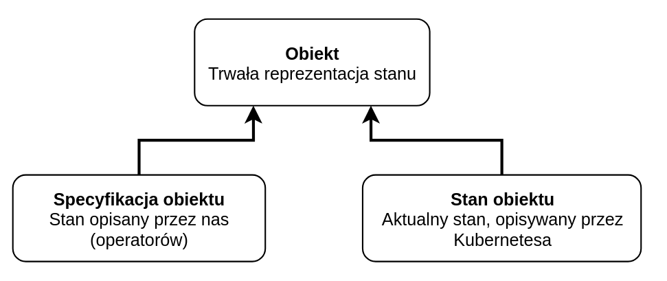
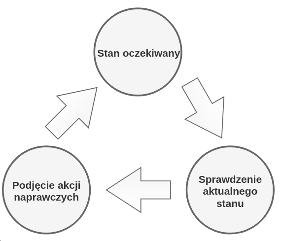
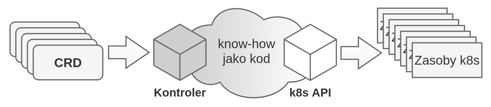

<!-- .slide: class="center pic-bg" data-background="./images/bg-wip.jpg" -->

<style>

.reveal {
  font-size: 36px;
}

.reveal pre {
  font-size: .4em !important;
}

.reveal h1 {
  background: linear-gradient(to right, #161616, #484848) !important;
  color: #fff;
  padding: 2rem;
  margin: 1% -5%;
  box-shadow: 0 4px 60px 10px rgba(255, 255, 255, 0.5), 0 6px 60px 10px rgba(255, 255, 255, 0.19);
}

.reveal h2 {
  background: linear-gradient(to right, #161616, #484848) !important;
  color: #fff;
  padding: 20px;
  margin: .5em -5%;
  box-shadow: 0 4px 60px 10px rgba(255, 255, 255, 0.5), 0 6px 60px 10px rgba(255, 255, 255, 0.19);
}

.reveal blockquote {
  width: 100%;
  font-size: .8em;
}

.reveal .stretch > code {
  /*max-height: none !important;*/
  /*height: auto !important;*/
}

.reveal section img {
  background: none !important;
  border: none !important;
  box-shadow: none !important;
}

.reveal .slides {
  text-align: left !important;
}

.reveal .slides {
  text-align: center !important;
  margin: auto !important;
}

.reveal ul > li {
  margin: 0 .5em;
}

.reveal ol > li {
  margin: .5em .5em;
}

.reveal code:not(.hljs) {
  font-size: 0.8em;
}

.reveal p, .reveal ul {
  background: rgba(255,255,255,0.75);
  border-radius: 10px;
  padding: 10px 40px;
  width: fit-content;
  margin: auto;
  margin-top: 1em;
}

.reveal .controls button, .reveal .progress {
  color: #484848;
}

.reveal a {
  color: #484848;
}

</style>

## Przemiana białka w kod - błyskawiczny wstęp do operatorów w Kubernetesie

**Wojtek Urbański**

Note: *tytuł tak długi, że prawie skończył się czas*

---

<!-- .slide: class="center pic-bg" data-background="./images/bg-mountains.jpg" -->

## Słowem wstępu

- nie wytłumaczę szczegółowo Kubernetesa...
- nie stworzę i nie pokażę operatora...

----

<!-- .slide: class="pic-bg" data-background="./images/bg-trail.jpg" -->

ale spróbuję dać Ci kilka wskazówek!

---

<!-- .slide: class="center pic-bg" data-background="./images/bg-containers.jpg" -->

## Kubernetes

- modny
- system do orkiestracji kontenerów*
- od Google
- programowanie w YAML-ach
- rozszerzalny (pod wpływem kodu, nie temperatury)
  

----

## Zasoby



----

## Pętla sterowania



----

## Kontrolery (deployment)


----
<!-- .slide: class="center pic-bg" data-background="./images/bg1.jpeg" -->

## Czy Kubernetesy będą łatwe?

----

<!-- .slide: class="center pic-bg" data-background="./images/bg-1z10.jpg" -->

## Otóż nie ;-)

----

<!-- .slide: class="center " data-background="./images/bg-messy.jpg" -->

bezstanowe procesy = dosyć łatwe
<br/>
<br/>
stanowe procesy = trochę trudne, ale w miarę wspierane
<br/>
<br/>
stanowe, złożone procesy = ^%$&&!@ 💩
---

<!-- .slide: class="center pic-bg" data-background="./images/bg-operator.jpg" -->

## Operator (człowiek)

- osoba 
- kontroluje, nadzoruje i wspiera procesy przebiegające w systemie
- posiada dogłębną wiedzę na temat jego działania 

----

<!-- .slide: class="center pic-bg"  -->

## Operator (w Kubernetesie)

???

----

<!-- .slide: class="center pic-bg" data-background="./images/bg-maintenance.jpg" -->

## dzień-1-oraz-dzień-2-jako-kod

[https://coreos.com/blog/introducing-operators.html](https://coreos.com/blog/introducing-operators.html) CoreOS, 3 listopada 2016

----

<!-- .slide: class="center pic-bg" data-background="./images/bg-operator-pattern.jpg" -->

## Wzorowy Operator <br>(Operator Pattern)

- "wzorzec projektowy" dla Kubernetesa 
- automatyzacja bardziej złożona niż wbudowane mechanizmy Kubernetesa

---

<!-- .slide: class="center pic-bg" data-background="./images/bg1.jpeg" -->

## Jak zamienić białko w kod? 

Rozszerzenie Kubernetes API przez:
- **Custom Resource Definition** (CRD)
- **Custom Resource** (CR)
- Własne Kontrolery Uwzględniające Rozmaite Właściwości

----

<!-- .slide: data-background="./images/bg-crd-prometheus.png" -->

----

## CustomResource

```yaml
# my-example-prometheus.yaml
apiVersion: monitoring.coreos.com/v1
kind: Prometheus
metadata:
  name: example
  labels:
    prometheus: k8s
spec:
  replicas: 2
  serviceAccountName: prometheus-k8s
  securityContext: {}
  serviceMonitorSelector: {}
  ruleSelector: {}
  alerting:
    alertmanagers:
      - namespace: monitoring
        name: alertmanager-main
        port: web
```

----

## Kontroler



- przeładowywanie konfiguracji
- restart usługi
- koordynacja między instancjami

----
<!-- .slide: class="pic-bg" data-background="./images/bg-sznuk.jpg" -->

## Jak po maśle

```bash
# odwdzięcz się za ogień
kubectl apply -f my-example-prometheus.yaml
# Pobierz wszystkie "prometeusze"
kubectl get Prometheuses
# zmień ustawienia danej instancji
kubectl edit Prometheus/example
# a na koniec ją usuń!
kubectl delete Prometheus/example
```

---

<!-- .slide: class="center pic-bg" data-background="./images/bg-robot-hand.jpg" -->
# Operator Opowi Opem

---

<!-- .slide: class="center pic-bg" data-background="./images/bg-shelf.jpg" -->

## Jak zacząć używać operatorów? 

* [https://operatorhub.io/](https://operatorhub.io/) 
* [https://github.com/operator-framework/awesome-operators](https://github.com/operator-framework/awesome-operators)

----

<!-- .slide: data-background="./images/bg-operatorhub-prometheus.png" -->


---

<!-- .slide: class="center pic-bg" data-background="./images/bg1.jpeg" -->

## Jak zacząć je tworzyć? 

- KUDO ([kudo.dev](https://kudo.dev))
- kubebuilder ([kubebuilder.io](https://kubebuilder.io))
- operator-framework ([gh/operator-framework](https://github.com/operator-framework/operator-sdk))
- kopf ([kopf.readthedocs.io](https://kopf.readthedocs.io))
- shell operator ([flant/shell-operator](https://github.com/operator-framework/operator-sdk))
- i inne...

---

<!-- .slide: class="center pic-bg" data-background="./images/amazon-ack.png" -->

---

<!-- .slide: class="center pic-bg" data-background="./images/bg-theend.jpg" -->

# Dziękuję

[wojtek@ninefiveslabs.io](mailto:wojtek@ninefiveslabs.io)

[slides.wurbanski.me/wstep-do-operatorow](https://slides.wurbanski.me/wstep-do-operatorow)

