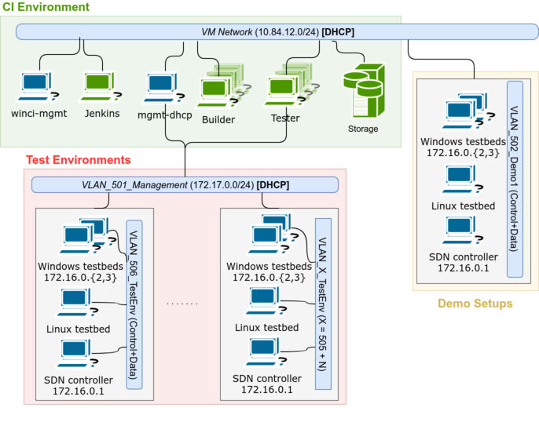

<!-- .slide: class="center" -->

<style>

.reveal pre {
  font-size: .4em !important;
}

.reveal h1 {
  background: linear-gradient(to right, #4882e1, #285baf) !important;
  color: #fff;
  padding: 2rem;
  margin: 1% -5%;
  box-shadow: 0 4px 8px 0 rgba(0, 0, 0, 0.2), 0 6px 20px 0 rgba(0, 0, 0, 0.19);
}

.reveal h2 {
  background: linear-gradient(to right, #4882e1, #285baf) !important;
  color: #fff;
  padding: 20px;
  margin: .5em -5%;
  box-shadow: 0 4px 8px 0 rgba(0, 0, 0, 0.2), 0 6px 20px 0 rgba(0, 0, 0, 0.19);
}

.reveal blockquote {
  width: 90%;
}

.reveal .stretch > code {
  max-height: none !important;
  height: auto !important;
}

.reveal section img {
  background: none !important;
  border: none !important;
  box-shadow: none !important;
}

.reveal .slides {
  text-align: left !important;
}

.reveal .slides .center {
  text-align: center !important;
  margin: auto !important;
}

.reveal li {
  margin: .5em;
}
</style>

## Czy Windows w systemie Continuous Integration może być obywatelem pierwszej kategorii?

Wojciech Urbański

Note: Według *prawa nagłówków Betteridge'a* na każdy nagłówek będący pytaniem można odpowiedzieć przecząco. Odpowiedź na dzisiejsze pytanie pozwolę sobie oczywiście zostawić na koniec.

----

## Notka wstępna

Prezentacja **będzie**:

- bazowała na prawdziwej historii
- o Windowsie w systemie CI
- ale nie tylko!

Prezentacja **nie będzie**:

- przepisem
- lekiem na całe zło
- *obiektywnie idealnym* rozwiązaniem.

Note: Zanim zaczniemy, wyjaśnijmy kilka spraw. (...) Chętnie przedyskutuję alternatywy w częsci z pytaniami lub networkingu.

---

## O mnie

Inżynier i magister. DevOps w sercu.

Początki: Administrator SKOS PG. Życie zawodowe w CI.

Automatyzacja, statystyki, monitoring.

Gdy brakuje mi narzędzi, to je sobie piszę. (Głównie w pythonie)

W wolnym czasie: gram, trochę podróżuję, robię zdjęcia telefonem. (:

[github](https://github.com/wurbanski/) - [twitter](https://twitter.com/wurbansk) - [blog](https://blog.wurbanski.me) - [e-mail](mailto:hello@wurbanski.me)

Note:

---

<!-- .slide: class="center" -->

# Zadanie

Zajmij się systemem CI <!-- .element class="fragment" -->

dla projektu Windowsowego... <!-- .element class="fragment" -->

związanego z SDN... <!-- .element class="fragment" -->

będącego portem z Linuksa. <!-- .element class="fragment" -->

Note: Postawcie się w sytuacji: trafiacie do nowego projektu. Dostajecie zadanie...
(...)
typowe dla DevOpsa

----

<!-- .slide: class="center" -->
# Wymagania

1. Ścisła definicja konfiguracji potrzebnych maszyn
2. Odporność na złośliwe akcje z zewnątrz
3. Określone wymagania sieciowe (o tym później)
4. Jak największa bezobsługowość
5. Wspólne rozwiązania dla różnych platform - duży plus

Note: (...) Brzmi łatwo, nie?

---

<!-- .slide: class="center" data-background='./images/bg1.png' -->
# Zrób to tak, żeby było dobrze

...i najlepiej na wczoraj ;-) <!-- .element class="fragment" -->

Note: 

----

## No Ops, please

System ma być dostępny dla programistów.

Najlepiej bez konieczności ciągłej kontroli i interwencji zespołu *DevOps*. 

<!-- .element class="fragment" -->

<div class="fragment">
<blockquote>
<p>Dawno temu ja też zaufałem pewnemu developerowi, wtedy dałbym sobie za niego rękę uciąć.</p>
<p>I wiesz, co... I bym teraz, windows, nie miał ręki.</p>
</blockquote>

<em>~Paulo DevOpselho</em>
</div>

Note: System dostępny dla programistów. To już brzmi dosyć przerażająco. Niestety, tak jak prawdopodobnie my nie jesteśmy najlepszymi na świecie programistami, tak progamiści często są PEBKAC.

A zostawić ich tam bez nadzoru? Wow, to odważne.

Oczywiście, na pewno każdy zna takich programistów, którym oddałby (ale na chwilę) pod kontrolę swoją konsole bez obaw. 

Nadal jednak ważna jest zasada ograniczonego zaufania. Jak na drodze.

----

## Projektowanie defensywne

>**Programowanie defensywne** - tworzenie oprogramowania z myślą o jego poprawnym działaniu nawet przy nieprzewidywalnych sposobach jego użycia.
>
>Techniki programowania defensywnego:
>- **Upraszczanie kodu źródłowego**
>- **Zewnętrzne audyty kodu źródłowego**
>- **Testowanie oprogramowania**
>- **Zasada najmniejszego uprzywilejowania**

*Źródło: [wiki](https://pl.wikipedia.org/wiki/Programowanie_defensywne)*

Note: Skorzystajmy więc z arsenału progamistów, aby chronić przed nimi nasz system. (...)

----

## Czego nam potrzeba?

1. Skutecznego i prostego zarządzania konfiguracją systemów.
2. Niezmienności infrastruktury.
3. Automatyzacji wprowadzania zmian (CI/CD dla infrastruktury).
4. Możliwości nadzoru nad kodem, który wpływa na infrastrukturę.

Note: Po takiej krótkiej analizie, bazując na doświadczeniach swoich i innych, można zebrać kilka istotnych dla nas kwestii przy projektowaniu systemu.

(...)

---

<!-- .slide: class="center" -->
# Case study

Note: 

---

<!-- .slide: class="center" -->
# Zarządzanie konfiguracją

Note:

----

## Dostępne narzędzia

1. [Powershell Desired State Configuration](https://docs.microsoft.com/en-us/powershell/dsc/overview)
2. Polityki Active Directory
3. Chef, Puppet, Saltstack
4. Ansible

Note: Zacznijmy od tematu najbardziej palącego, ale jednocześnie chyba najbardziej znanego...

Na poprzednim SO/Do Meetupie Maciek mówił, że zarządzanie konfiguracją umiera i kontenery są przyszłością... warto doprecyzować, że to prawda tylko w niektórych zastosowaniach, a pewnych zadań nie jesteśmy w stanie przenieść w prosty sposób do kontenerów...

(...)

----

## Powershell DSC

Podejście Microsoftu do Configuration Managementu.

Obsługuje tryby *push* i *pull*.

Długa lista zarządzalnych zasobów (wszystkie elementy systemów).

(Subiektywnie) Skomplikowany system przygotowywania konfiguracji serwerów.

Note: Microsoftowe podejście do tematu IaC. Jest architektura Push/Pull

----

## Powershell DSC

```powershell
Configuration WebsiteTest {
    Import-DscResource -ModuleName PsDesiredStateConfiguration

    Node 'localhost' {
        WindowsFeature WebServer {
            Ensure = "Present"
            Name   = "Web-Server"
        }
        File WebsiteContent {
            Ensure = 'Present'
            SourcePath = 'c:\test\index.htm'
            DestinationPath = 'c:\inetpub\wwwroot'
        }
    }
}
```
<!-- .element class="stretch" -->

Note: Fragment kodu odpowiadający za konfigurację IIS i przykładowej strony WWW. Składnia niby podobna do innych systemów.

----

## Polityki Active Directory

Plusy:

+ wszystko dzieje się w tle
+ natywny dla Windowsa sposób zarządzania
+ DHCP, DNS, LDAP
+ "wystrzel i zapomnij"

----

## Polityki Active Directory

Minusy:

- **licencjonowanie**
- względnie skomplikowana infrastruktura do utrzymywania
- dodatkowa warstwa abstrakcji
- wprowadzanie zmian na *żywym organizmie*
- trudna analiza i wersjonowanie kodu

Note: Active Directory, usługa katalogowa (i nie tylko) dla Windowsa, ma wiele mozliwości. Poza synchronizacją kont użytkowników, DNS i DHCP pozwala na zarządzanie podłaczonymi do niej maszynami.

Licencjonowanie produktów Microsoftu jest skomplikowane.

----

## Chef, Puppet, Saltstack

**Chef, Puppet**: Ruby na windowsie = :(

**Saltstack**: zbyt skomplikowany jak na cel, który chcemy osiągnąć

Note: Znane rozwiązania.

----

## Ansible

- łatwy do nauki
- łączy się wykorzystując natywny mechanizm: *Windows Remote Management*
- wykorzystuje *Powershell* do wykonywania operacji
- można go wykorzystać jako wrapper na DSC
- zdecentralizowany
- [Ansible Galaxy!](https://galaxy.ansible.com)

Note: Ansible.

---

## Ansible ❤ Windows

Używa natywnego powershellowego połączenia przez bibliotekę `pywinrm`.

Wspiera wiele opcji uwierzytelnienia: `basic auth`, `certificate`, `kerberos`, `NTLM`, `CredSSP`.

`Kerberos` - do łączenia się do systemów podpiętych do AD.

`CredSSP` - do łaczenia się do maszyn bez i z AD.

[dokumentacja](http://docs.ansible.com/ansible/latest/intro_windows.html#windows-how-does-it-work)

Note: Od ansible 1.7 wspierany jest Windows. Bezagentowo.

----

## Konfiguracja

1. Automatyczna Windowsa konfiguracja skryptem [ConfigureRemotingForAnsible.ps1](https://github.com/ansible/ansible/blob/devel/examples/scripts/ConfigureRemotingForAnsible.ps1)

```powershell
powershell.exe -File ConfigureRemotingForAnsible.ps1 -EnableCredSSP -ForceNewSSLCert
```

1. Odpowiednie zmienne w `inventory` dla ansible'a: 

<!-- .element: start="2" -->

```yaml
ansible_user: Administrator
ansible_password: SecretPasswordGoesHere
ansible_port: 5986
ansible_connection: winrm

# The following is necessary for Python 2.7.9+ when using default WinRM self-signed certificates:
ansible_winrm_server_cert_validation: ignore
```

Note: 

----

## Przykładowa rola

Zainstalujmy `Docker-EE` z natywnymi kontenerami na Windows Server 2016:
```yaml
- name: Instalacja Windows-Containers
  win_feature:
    name: 'Containers'
    state: present

- name: Instalacja Hyper-V
  win_feature:
    name: 'Hyper-V'
    include_management_tools: True
    state: present

- name: Instalacja DockerProvider
  win_psmodule:
    name: DockerProvider

- name: Restart (nadal jest to windows...)
  win_reboot:

- name: Instalacja Docker-EE
  win_shell: "Install-Package Docker -ProviderName DockerProvider -Force"
```
<!-- .element class="stretch" -->

Note: Zobaczmy, jak wygląda instalacja Dockera Enterprise (licencja wspólnie z licencja na Windows Server)

----

## Zarządzanie zainstalowanymi aplikacjami

```yaml
# Korzystając z pakietów MSI
- name: Install VisualCPP Build Tools
  win_package:
    path: '\\remote_location\\visualcppbuildtools_full.exe'
    state: present
    product_id: '{79750C81-714E-45F2-B5DE-42DEF00687B8}'
    arguments: /Quiet /NoWeb /InstallSelectableItems

# Korzystając z chocolatey
- name: Install python 2.7.13
  win_chocolatey:
    name: python2
    version: 2.7.13
    state: present
```

Note: Zarządzanie pakietami jest stosunkowo proste korzystając z paczek MSI lub bardzo proste korzystając z chocolatey.

----

## Chocolatey

*__The__ package manager for windows.*

Powershellowe opakowania na automatyczne instalatory z sensownymi wartościami domyślnymi.

Pokaźne repozytorium paczek dodawanych przez społeczność.

Wersja darmowa raczej ryzykowna dla *enterprise*'u:
- brak instalacji bez dostęu do Internetu
- brak automatycznej *rekompilacji* pakietów

[chocolatey.org](https://chocolatey.org)

Note: Manager pakietów dla Windowsa. Microsoft zrobił również wewnętrzny system, może on korzystać z chocolatey jako dostawcy paczek.

----

<!-- .slide: class="center" -->
## Mam role, co dalej?

Odpal ansibla, wypij ~~kawę~~yerbę, poprzeglądaj ~~kotki~~branżowe strony w sieci.

[](https://xkcd.com/303/) <!-- .element class="fragment stretch" -->

Note: Uzbrój się w cierpliwość, szczególnie jeśli chcesz instalować Visual Studio.

---

<!-- .slide: class="center" -->
# Niezmienność infrastruktury

aka *Immutable infrastructure*

Note:

----

## Etapy tworzenia maszyny z Windowsem

1. Zaprzeczenie
2. Gniew
3. Targowanie
4. Depresja
5. Akceptacja

<!-- .element class="fragment" -->

Note: Hehe.

----

## Etapy tworzenia maszyny z Windowsem

1. Ustawienia podstawowe (40 - &infin; minut) <!-- .element class="fragment" -->
2. Konfiguracja do realizacji zadania (20-60 minut) <!-- .element class="fragment" start="2" -->
3. Właściwe wdrożenie maszyny do systemu (~5 minut) <!-- .element class="fragment" start="3" -->

Note: 1. Konta użytkowników, instalacja aktualizacji, konfiguracja sieci.
2. Instalacja kompilatorów, narzędzi, Dockera, koparki bitcoinów...
3. Wpięcie jako agenta, włączenie monitoringu...

----

## Cykl życia maszyny wirtualnej

TODO: Obrazek
```
Bazowy obraz systemu -> Obraz roli w systemie -> Deployment i finalizacja maszyny
```

Note:

----

## Wprowadzanie zmian do obrazów

```
 +-----------------+
 | Zmiany w rolach +-+
 +-----------------+ |
                     |
+--------------+     |   +------+      +-------+
| Bazowy obraz +-----+-->+ Rola +--+-->+ Start |
+-------+------+         +------+  |   +-------+
        ^                          |
+-------+-------+  +---------+     |
| Patch Tuesday |  | Trigger +-----+
+---------------+  +---------+

```

Note:

---

<!-- .slide: class="center" -->
# CI/CD dla infrastruktury

Note:

----

## Janie, przetestuj proszę

Jenkins - mój ulubiony frontend do crona.

Wersja 2.0+ - wbudowany **pipeline plugin**!

Kod wykorzystywany do testowania konfiguracji przechowywany wspólnie z nią w repozytorium gitowym.

Note:

----

## `CIfIaCaC`

`Continuous Integration for Infrastracture as Code as Code`

```groovy
pipeline {
  agent { label "ansible" }
  stages {
    stage "Prepare config" {
      prepareConfig "builder"
    }
    stage "Run Ansible" {
      dir "ansible" {
        ansiblePlaybook inventory: 'inventory',
                        playbook: 'deploy.yml'
      }
    }
  }
  post {
    always {
      deleteDir /* sprzątamy */ 
    }
  }
}
```
<!-- .element class="stretch" -->

Note:

----

## Skalowanie Jenkinsa

Klasyczna instalacja agenta przez Java Web Start wymaga przeglądarki.

SSH Agent? <!-- .element class="fragment" -->

[Swarm plugin!](https://plugins.jenkins.io/swarm)<!-- .element class="fragment" -->

[Rola w Galaxy](https://galaxy.ansible.com/reynn/jenkins-swarm/) <!-- .element class="fragment" -->

Note:

----

## Instalacja agenta swarm

Bardzo prosta, na *dowolnym* systemie operacyjnym, za pomocą roli z Galaxy.

Przykładowy playbook:
```yaml
- hosts: jenkins_agents
  vars:
    jenkins_agent_master: "{{ hostvars.example_master.ansible_host }}",
    jenkins_agent_num_executors: 8,
    jenkins_agent_labels: "Windows dotnet swarm msbuild"

  roles:
    - reynn.jenkins-agent
```

Note:

---

<!-- .slide: class="center" -->
# Wyzwania

Lub: *Fantastyczne rozwiązania i jak je znaleźć?*

Note:

----

## Dryft konfiguracji

**Problem:** Wszystkie systemy o zarządzanej, ale nie blokowanej konfiguracji są podatne na dryft - odbiegnięcie maszyny od stanu oczekiwanego.

**Rozwiązanie:** Cykliczne i automatyczne niszczenie i odtwarzanie środowiska z wzorców. 

<!-- .element class="fragment" -->

Note:

----

## Powiązane zmiany kodu i infrastruktury

**Problem:** Zmiana w kodzie aplikacji wymaga zmian w narzędziach zainstalowanych w obrazie.

**Rozwiązanie:** Ręczny test i zsynchronizowane przepięcie środowiska. <!-- .element class="fragment" -->

**Rozwiązanie:** Docker. <!-- .element class="fragment" -->

Note:

---

## Z Waszych połączonych mocy...



Note:

----

## Zarządzanie środowiskiem używając Ansible

Ansible + VMWare = :|

pyVmomi przychodzi na ratunek.

Note:

---

# Co na przyszłość?

[Terraform?](https://www.terraform.io) <!-- .element class="fragment" -->

[Packer?](https://www.packer.io) <!-- .element class="fragment" -->

[Boxstarter?](http://boxstarter.org) <!-- .element class="fragment" -->

Note:

---

<!-- .slide: class="center" -->
# Czy Windows w systemie Continuous Integration może nie być obywatelem gorszego sortu?

Note:

---

<!-- .slide: class="center" -->
# Dziękuję :)

Pytania? 

[e-mail](mailto:hello@wurbanski.me) <!-- .element class="fragment" -->
